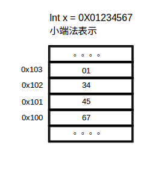

### 初识c语言指针
 作为一只java汪,平时不会去关注指针方面的知识,这两天在看csapp时,看见指针好像能做一些有趣的事情,决定把当初学C语言时把我弄的晕头转向的指针好好看看,总结一下。  

##### 1. 指针是什么？   
我们常常听一些大神说，指针很简单啊，无非是一个存着指向某个地址空间的变量而已，其实要弄懂这个，需要从了解计算到底是以一个怎样的形式来存储信息开始看。
 > 机器其实没有我们人这么聪明，他能快速理解的就是0,1这样的信息，也就是我们说的位，单纯的来讲，一个位并不能表示什么很有用的信息，但是如果我们用一段序列的位来表示信息，如8位来表示某个信息，算一算我们可以有多少种组合？如果32位呢？64位呢？  

###### 1.1 信息的存储
在大多的计算机上使用8位的块为一个最小的可寻址单位，我们也称作字节，操作系统的形成是为了我们更方便的与底层硬件交互，操作系统提供给我们一个大的`虚拟存储器`，看起来像一个超级大的字节数组，每个字节都有唯一一个标识他的数字，也就是`地址`。  
**下面给出一个整数类型的变量在内存中存储的形式**

我们可以看到，一个int类型的变量是占了连续的4个字节的存储空间，但是在我们写的文本代码被编译器翻译成机器码时，机器会忽略变量的类型，对于机器码来说说，会被翻译成，从首地址地址0x100开始，向后读取4个字节。所以我们的一个int类型的变量可以用指针来读取，一个指向int类型的指针中存储的值就是某个int类型变量的首地址。指针也是一个变量，只是他有特殊的含义而已。  
一般来说，一个指针变量所占的字节数与机器使用的字长有关，32位的机器使用4个字节来存储指针变量，64位的机器使用8个字节来存储指针，很好理解，因为指针是用来表示地址的，如果不是对应的位数来表示指针，那么会有一些存储空间无法访问。  
** 一个关于指针的小例子 **  

     
 
 
 
