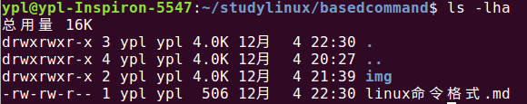

### linux基本命令格式
- **基本格式**  
    命令 [选项] [参数]  
  > 个别命令不遵循此规范  
    当有多个选项时写在一起  
    简化选项与完整选项,功能相同,只是写法不同  
    eg: `ls -a == ls --all`  
    
    例子:  
         
        ls -a     查看全部文件,包括扩隐藏文件
        ls -l    -l:long   以长(详细的)方式查看
        ls -ld /usr/local    -ld:查看目录详细信息   'usr/local':参数
        ls -h    -h:以人看得懂得方式查看(human)
   
    **ls -lha:**  
      
    
    

    

